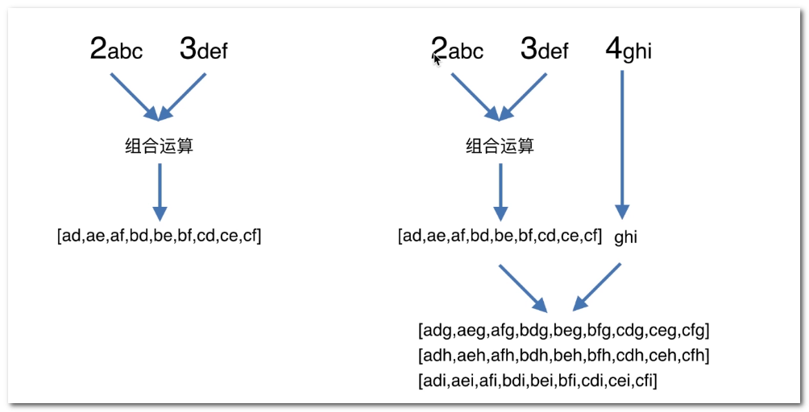
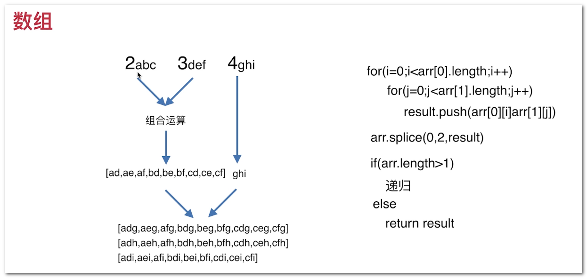
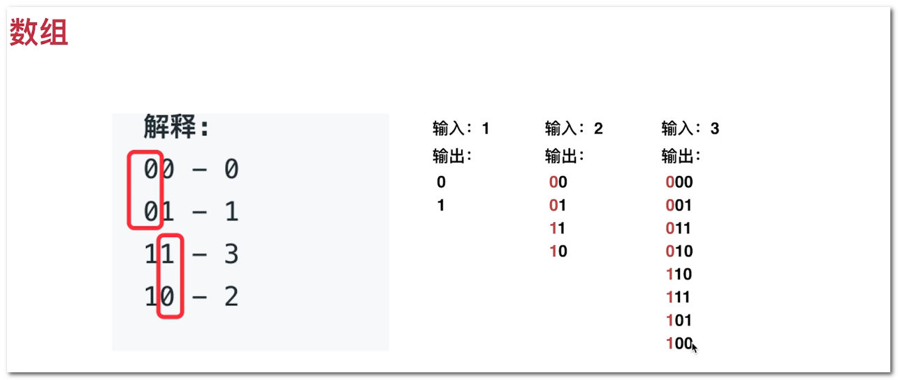

## 基础算法 数组类

电话号码的组合 --- 公式运算。数学公式相关的运算，如 组合运算

卡牌分组 --- 归类运算

种花问题 --- 筛选（过滤）运算

格雷编码 --- 二进制运算

### 电话号码组合

[leetCode: 17](https://leetcode-cn.com/problems/letter-combinations-of-a-phone-number/)

#### 思路







### 卡牌分组

#### 知识点

```js

Array.prototype.sort()

/**
 * 删除数组的第一个元素 直接修改原有数组
 * @return 原数组的第一个元素 | 数组为空 返回 undefined
 */ 
Array.prototype.shift()

/**
 * 向数组开头添加一个或更多元素
 * @return 添加后的数组长度
 * 
 * @example 
 * // return 4
 * var a = [1,2]; a.unshift(3,4);
 * a // [3, 4, 1, 2]
 */ 
Array.prototype.unshift()
```


#### 求最大公约数

**更相减损法 （辗转相减法）**

**辗转相除法（欧几里得算法 Euclidean algorithm）**

用较大的数除以较小数，再用出现的余数（第一余数）去除除数，再用出现的余数（第二余数）去除第一余数，如此反复，直到最后余数是 0。

如果求两个数的最大公约数，最后的除数就是这两个数的最大公约数。

```js
gcd(除数, 第一余数)

gcd(第一余数, 第二余数(第一余数 % 除数))
```

### 种花问题

[leetCode: 605](https://leetcode-cn.com/problems/can-place-flowers/)

1. 边界问题
2. 条件

#### 知识点

问题抽象、数学建模的思想、动态输入（输入对思维的检验，不断调整输入）

AI 讲究的就是训练模型，就是不断的变换动态输入。让规则（实现）适应更多的情况


### 格雷编码

[leetCode: 89](https://leetcode-cn.com/problems/gray-code/)



发现规律、 动态输入
