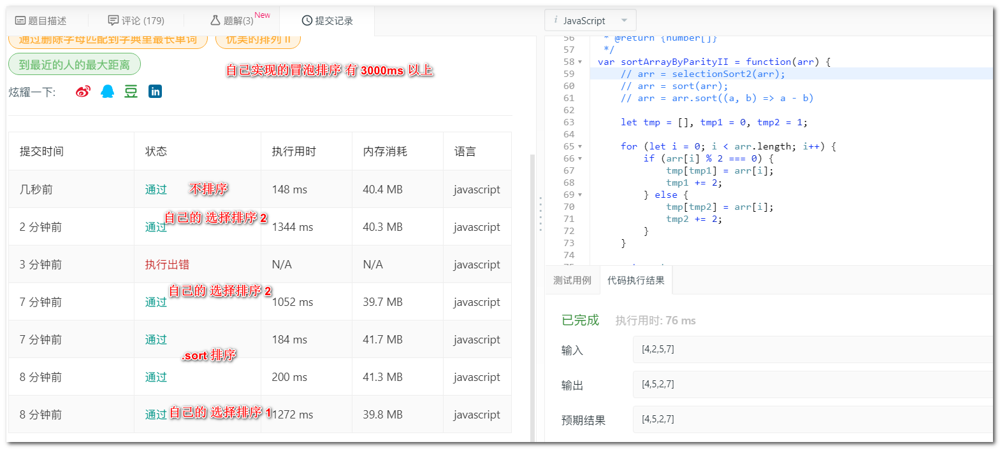

## 基础算法 排序类

时间复杂度看运行次数；空间复杂度看占得空间

基础排序 冒泡排序，选择排序

排序问题的变种：在排序基础上做一个演变，延伸

如 按奇偶排序数组、数组中的第 K 个最大元素、最大间距、缺失的第一个正数

### 如何评价分析一个排序算法

**最好、最坏、平均时间复杂度**

**时间复杂度的系数、常数、低阶**：在实际软件开发中，可能数据规模较小，在对同一阶时间复杂度排序算法性能比较的时候，就需要把 系数、常数、低阶也考虑进来

**排序算法的稳定性**：待排序序列中，值相等的两个元素在排序前后，相对顺序没有发生变化

一定要对基础的排序算法熟悉，他是所有变种排序的基石，可以改造出性能高的算法

### 冒泡排序 Bubble Sort

原理：冒泡排序每次会对比相邻的两个元素之间的大小关系，如果不满足要求，就交换位置。一次冒泡至少可以让一个元素到达他应该在的位置，重复 n 次就完成了 n 个数据的排序

最好时间复杂度：n
平均时间复杂度：n^2
最坏时间复杂度：n^2
稳定性：Yes

### 选择排序 Selection Sort

#### 原理

从无序序列中，选择最小（大）的值，与当前位置进行交换

#### 算法描述

#### 动图演练

### 按奇偶数排序数组

[leetCode: 922](https://leetcode-cn.com/problems/sort-array-by-parity-ii/)

索引是奇数，值也为奇数；
索引是偶数，值也为偶数；

奇偶排序第一种方法，使用选择排序与 自带的 `[].sort()` 方法的时间空间复杂度（在 leetCode）对比

### 数组中第 K 个最大的元素

[leetCode: 215](https://leetcode-cn.com/problems/kth-largest-element-in-an-array/)

### 最大间距

[leetCode: 164](https://leetcode-cn.com/problems/maximum-gap/)

求无序数组，排序后：相邻元素之间最大的差值
