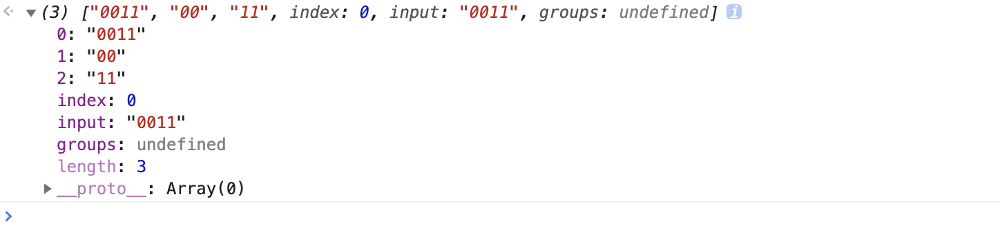

## 基础算法 字符串类


### 1 反转字符串中的单词

[leetCode: 557](https://leetcode-cn.com/problems/reverse-words-in-a-string-iii/)

#### 知识点

```js

/**
 * 把一个字符串分割成字符串数组
 * @params {string | RegExp} separator 分割器 字符串或正则表达式
 * @params {number ?} howmany 限制返回分割片段的数量
 * @return { string[] }
 */
String.prototype.split(separator, howmany)

// 在字符串中检索指定的值，找到一个或多个正则匹配到的值 返回数组
// 参数：字符串 或者 正则表达式
// \w：匹配字母数字下划线
// \s： 任何空白字符
// 正则使用 g 标志位：正则匹配的所有结果组成的列表
// 不使用 g 标志位：在字符串中执行一次匹配；匹配不到返回 null
  // 匹配到返回一个数组： 0-匹配的的文本；其余元素存放正则子表达式匹配的文本；index-匹配字符串在源字符串中的位置；input-源字符串的引用
String.prototype.match

Array.prototype.map

// 反转数组中的方法，返回原数组引用（更改原数组）
Array.prototype.reverse

Array.prototype.join
```



### 2 计数二进制子串

[leetCode: 696](https://leetcode-cn.com/problems/count-binary-substrings/)


通过画“辅助线”寻找规律

数据结构：

数组，有 pop, shift, unshift, 他是可以做到先入后出，先进先出。

所有可以把数组用作 队列，也可以用作堆栈


#### 知识点

```js
/**
 * 提取某个字符串的一部分并返回新的字符串
 */ 
String.prototype.slice
String.prototype.match

'0' ^ 1 => 1
'1' ^ 1 => 0 

/**
 * 构造并返回一个新的字符串
 * @params {number} count 重复 count 次原字符串
 * @return {string} 重复后的新字符串
 */ 
String.prototype.repeat(count)
Array.prototype.push

// 设置动态规则的正则
// let reg = new RegExp(`^${j}${o}`);
RegExp
```

[^ 按位异或 运算符](https://developer.mozilla.org/zh-CN/docs/Web/JavaScript/Reference/Operators/Bitwise_Operators#(按位异或))

任意数值与 0 异或（ a ^ 0 => a）
