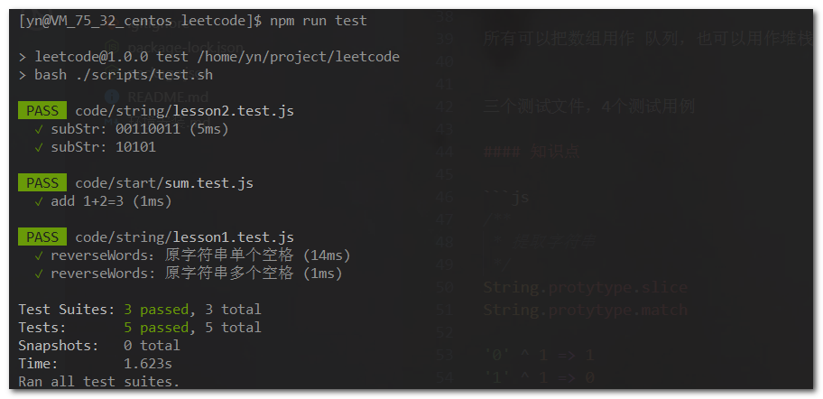
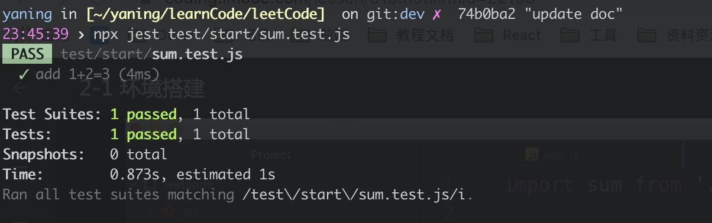

# 环境安装

需要准备的相关知识点

ES6 Jest npm Node Git

## [自动化测试 - Jest](https://jestjs.io/docs/en/getting-started)

[GitHub: Jest](https://github.com/facebook/jest)

FaceBook 推出的基于 Jasmine 的 JavaScript 单元测试和自动化 Mock 工具

**使用目的**
借助自动化测试，提升开发效率，快速验证算法写的是否正确

**测试示例**

(Test Suites) 3 个测试文件，(Tests) 5 个测试用例 



### 安装使用

```bash
# 安装 Jest
$ yarn add --dev jest
# or
$ npm install --save-dev jest
```

### 其他配置

- `.babelrc` - 主要配置对 ES6 的解析，不然在 Jest 中，所有 ES6 语法会报错
- `.eslintrc.js` - 自动格式化，写法有问题不会提示
- `package.json` - 相关的依赖包以及版本有问题


1. 安装
2. 
```bash
# 在 Jest 中使用 babel
npm install --save-dev jest
npm install babel-jest babel-core@^7.0.0-bridge.0 @babel/core regenerator-runtime babel-preset-env
```

编辑 package.json

```json
{
    "scripts": {
        "test": "jest"
    }
}
```

编辑.babelrc

```json
// {
//     "presets": ["env", "react"]
// }
{
  "presets": ["@babel/preset-env"]
}
```

2. 创建 js 文件

```js
function sum(a, b) {
    return a + b;
}
export default sum;
```

```js
import sum from "./index";

test("adds 1 + 2 to equal 3", () => {
    expect(sum(1, 2)).toBe(3);
});
```

3. 启动测试

```bash
npm test
```



4. 工具安装

-   IDE：Atom
-   插件：[platformio-ide-terminal](https://github.com/platformio/platformio-atom-ide-terminal)

### 断点调试算法代码

#### 在 Chrome 控制台调试

需要在代码中设置 debugger 才能停止
```bash
$ npx babel-node --inspect ./code/other/byteConvert.js
```

#### 在编辑器中调试

需要先在代码中打断点或者 debugger 才能自动暂停；调试是通过测试文件进入的

TODO: 此配置在 window 上，编辑器按 F5 后进入调试模式，路径分隔符问题导致 jest 匹配不到当前文件
```json
// .vscode/launch.json
{
  // Use IntelliSense to learn about possible attributes.
  // Hover to view descriptions of existing attributes.
  // VSCode 所有变量引用：https://code.visualstudio.com/docs/editor/variables-reference
  // For more information, visit: https://go.microsoft.com/fwlink/?linkid=830387
  "version": "0.2.0",
  "configurations": [
    {
      "type": "node",
      "request": "launch",
      "name": "Jest Debug CurTestFile",
      "program": "${workspaceFolder}/node_modules/jest/bin/jest",
      "runtimeArgs": [
        // "--inspect-brk"
      ],
      "stopOnEntry": false,
      "args": [
        // jest 运行时参数，对调试比较管用
        "--runInBand",
        "--env=jsdom",
        // "${fileBasename}"
        "${file}"
      ],
      "cwd": "${workspaceFolder}",
      "sourceMaps": true,
      "console": "integratedTerminal"
    }
  ]
}
```
